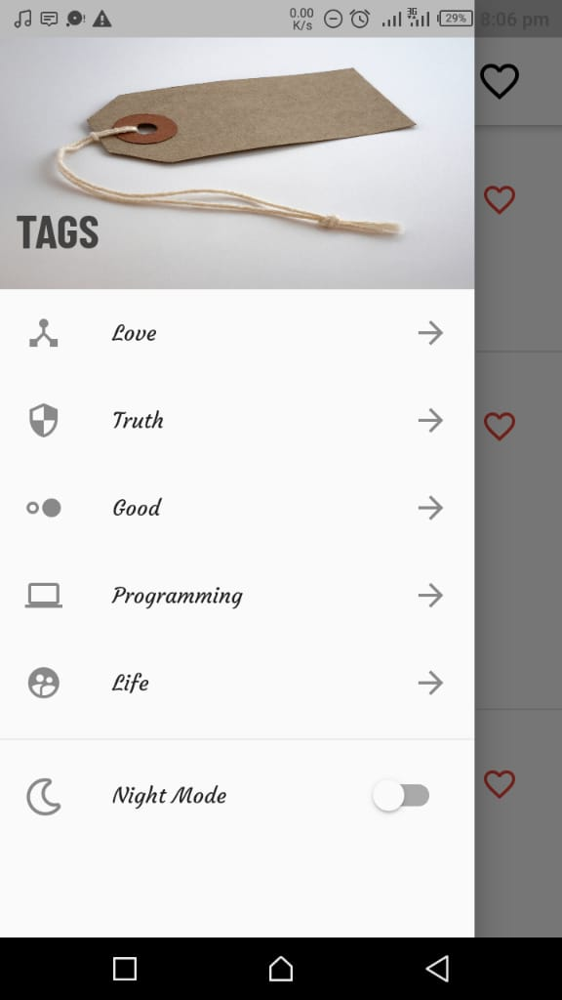
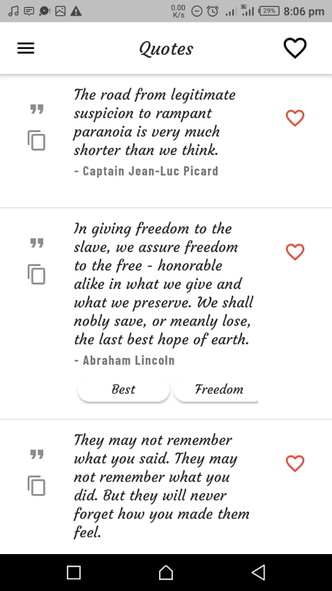
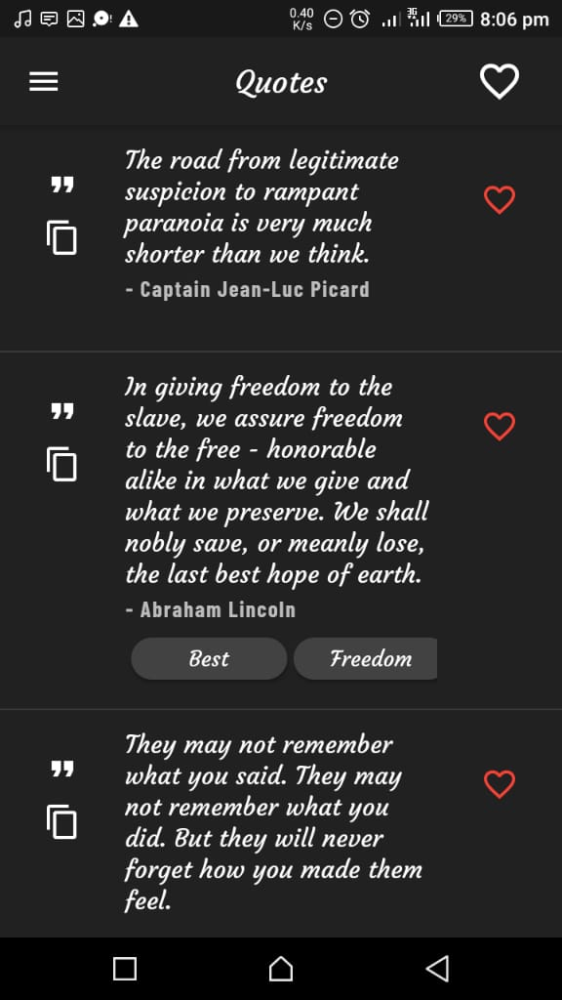
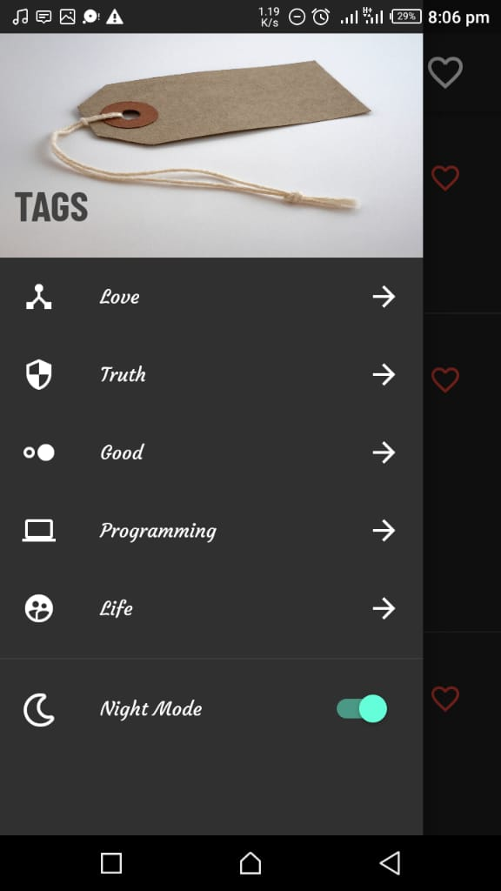

# Flutter Quote App

A new Flutter application that displays lists of Quotes fetched from [FavQs](https://favqs.com/api/).

### Features

- List of Quotes
- Fetch tag related Quotes
- Add a Quote to favorites (can be accessed offline)

#### Flutter App Screenshots

<table>
  <tr>
     <td>List of Quote Dark Mode</td>
     <td>Drawer Light Mode</td>
  </tr>
  <tr>
    <td></td>
    <td></td>
  </tr>
  <tr>
     <td>List of Quote Dark Mode</td>
     <td>Drawer Dark Mode</td>
  </tr>
  <tr>
    <td></td>
    <td></td>
  </tr>
 </table>

## Getting Started

This project is a starting point for a Flutter application.

A few resources to get you started if this is your first Flutter project:

- [Lab: Write your first Flutter app](https://flutter.dev/docs/get-started/codelab)
- [Cookbook: Useful Flutter samples](https://flutter.dev/docs/cookbook)

For help getting started with Flutter, view our
[online documentation](https://flutter.dev/docs), which offers tutorials,
samples, guidance on mobile development, and a full API reference.
